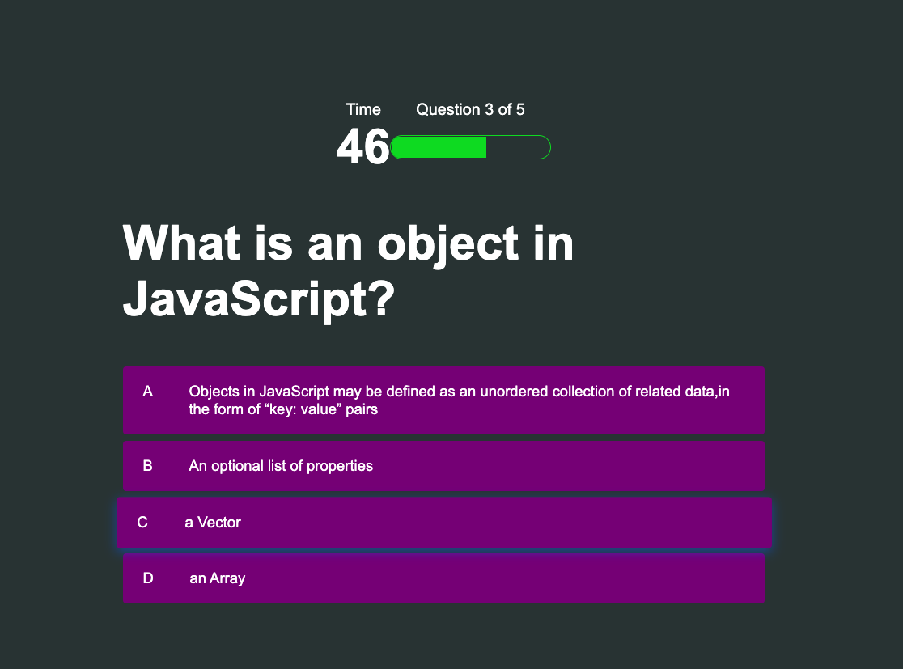
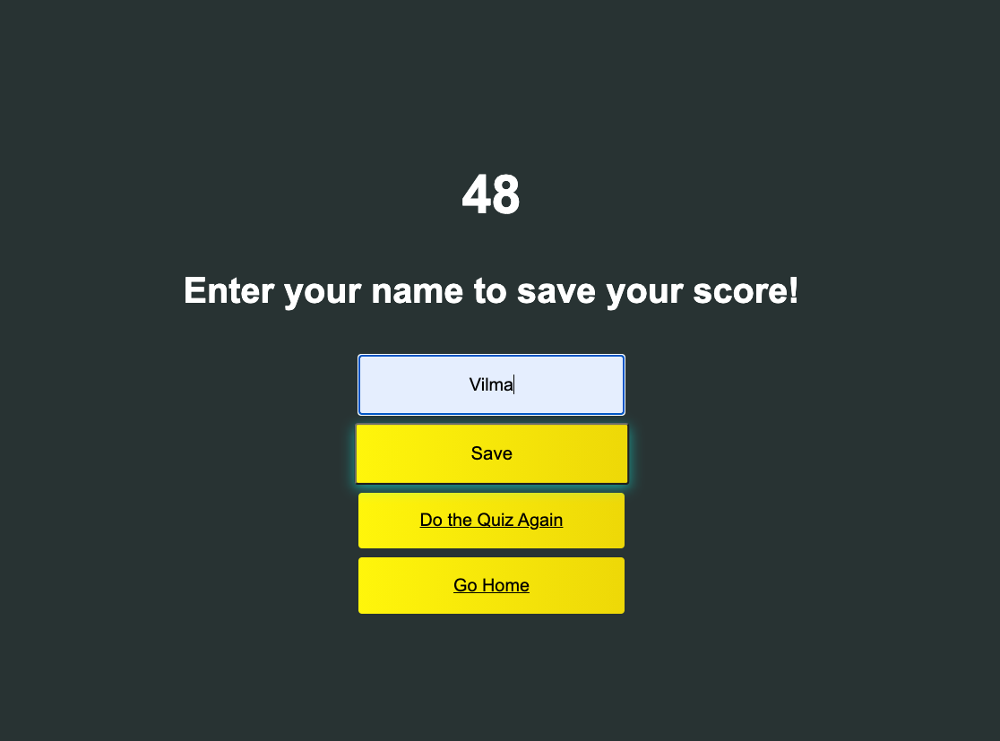
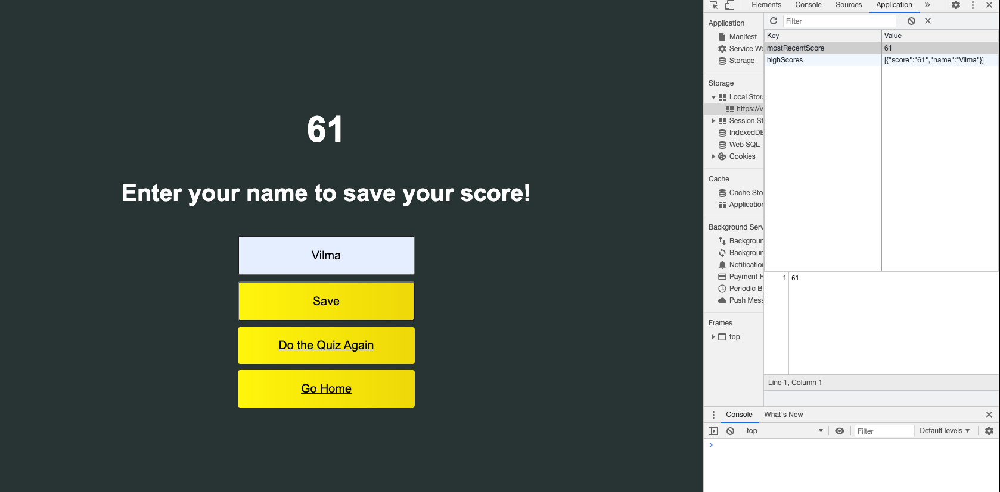

# Quiz - homework 4

## Description

The aim of this project is to load a Quiz for the user with the possibility to store the scores and his/her username at the end of it.
The scores will be calculated based on the time left to complete the quiz, subtracting 5 seconds for each incorrect answer.

### User flow:

1. Click the start button to start the Quiz
2. Timer starts
3. User is presented with the first question
4. Choosing an option from the choice list will shade the answer green if correct or red if incorrect and after 1000ms it will load randomly the next question
5. For every incorrect choice time will be subtracted from the time left, displayed in the screen
6. If time reaches 0 OR all the questions are answered, the user will be presented with teh Highscores and a textbox to save his username
7. User sees high score, can enter initials and save the score
8. User will be presented with two options 'Do the Quiz again' (reloads the quiz) or 'Go Home' (jumps to home page where user can click start to start the quiz)

### Layout Flow

#### Home Page

User will be presented with two buttons Start and High Scores.
Start button will start the quiz by jumping to another html page quiz.html

#### Quiz Page

User will be presented with the first question. At the top of the page he/she can see the timer and the progress of the questions. The choice will change its background green if it is the correct answer or red if incorrect.

#### High Scores Page

High score page will be loaded if all the questions have been answered or the timer has reached 0. At the end of the quiz, the user will be presented with the scores, a placeholder to insert his/her name and save it in the local storage; 'Do the Quiz Again!' button that will reload the quiz again and 'Go Home' button that will make the user jump the home page.

#### Saving the scores and username in local storage

## Links to the project

- Git site url: https://vilmaq.github.io/code_quiz/index.html
- Git repository: https://github.com/vilmaq/code_quiz
